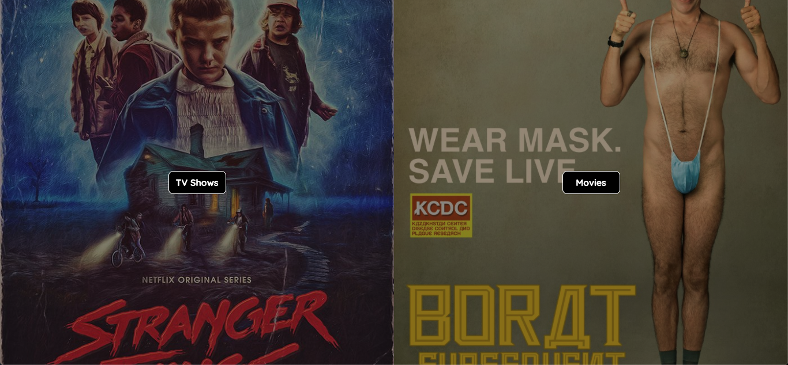
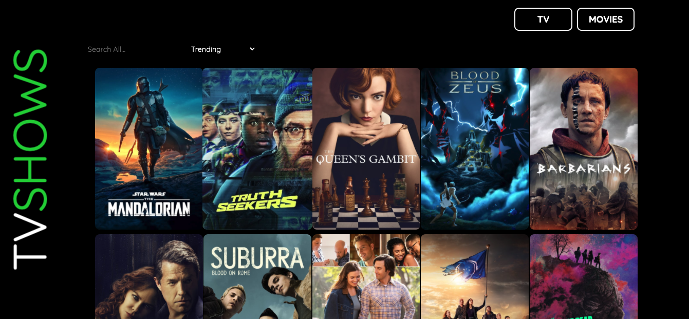

### General Assembly Software Engineering Immersive 
# Project 2 - TVMovieBoard   

## Description
This application is a service where a user can filter trending, popular, 
top rated or manually searched television and movie information. The primary purpose of
this project was to solidify JavaScript, CSS, REACT and API navigation skills developed during my time in the General Assembly Software Engineering Immersive by completing the project in a 48hr 'Hackathon'. 

## Usage
Greeted by a split landing page, you are able to to choose to search either 
TV or Movies.
After selection, a simple user interface allows for left clicking any media title displayed to promulgate further information
about the movie or series. 
Filtering content can be completed via a search bar or by using a dropdown element. 
The dropdown will allow filtering by the following:

Movies | TV
----------- | ------------
Trending    | Trending
Popular | Popular
In Cinemas | Airing Today
Top Rated | Top Rated
Coming Soon | 

*This is a web-based application only.*

## Dependencies / Coding Tools
* npm
* Javascript
* CSS 
* Axios
* React
* Webpack
* Babel
* TMDB API

## The Frontend

In order to create a streamlined multipage website we used ReactJS. This was our first time using this in a project and we found it fairly simple to get our heads around. 

### The Routes

```javascript
const App = () => (
  <BrowserRouter>
    <Switch>
      <Route exact path="/" component={Home} />
      <Route exact path="/movies" component={Movies} />
      <Route exact path="/tv" component={TV} />
      <Route exact path="/movies/:id" component={Movie} />
      <Route exact path="/tv/:id" component={Series} />
      <Route exact path="/tv/:id/:season" component={Season} />
    </Switch>
  </BrowserRouter>
)
```

We kept the routes as simple as possible so that it was easy for us to build upon. We used BrowserRouter, Switch and Route from React-Router-DOM, this made the routing as simple as it could possibly be.

### Components

Using ReactJS meant that we could easily seperate pages from each other. These are all of the components we used:

- Home
- Movies
- TV
- Movie
- Series
- Season

One thing we could have done is differentiate the names a bit more from each other - Movies and Movie could get confused, as could Series and Season.

Here is how we got all of the movie data from the API:

```javascript
const [movies, updateMovies] = useState([])

useEffect(() => {
    async function getMovieData() {
      const { data } = await axios.get(`https://api.themoviedb.org/3/trending/movie/day?api_key=${process.env.API_KEY}`)
      updateMovies(data.results)
    }
    getMovieData()
  }, [])
```
We used useState to keep the data in state and useEffect so that we do not create an infinite loop of fetching data over and over again. We then looped over the 'movies' array, as seen below:

```javascript
<section className="cards">
	{movies.map((movie, index) => {
		const imgSrc = `https://image.tmdb.org/t/p/w500/${movie.poster_path}`
		return <div key={index} className="card">
			<Link to={`/movies/${movie.id}`}>
				<label>
					
          	</label>
         	</Link>
     	</div>
  	})}
</section>
```
Using ReactJS made the whole process of manipulating the HTML aspects a lot easier than it was in my first project where we had to use 'Vanilla' HTML, CSS and JavaScript.

We used this method of storing and displaying data across the whole app, fetching within a useEffect and storing in useState, then mapping the array, displaying it to the screen.

## URL Section 
* [Website](harrytodd.github.io/project-2/)
* [Github Repo](https://github.com/harrytodd/project-2)

## Visuals
###### Landing Page

###### Sample Page


## Future Releases
Due to the infancy of the project and the speed in which it was created, further functionality 
may be developed to include torrent API fetching, watching content in browser, additional filtering 
options etc. Other ammendments need to be made for mobile responsiveness and series card information
styling. 

## Contibutors 
#### Harry Todd 
#### Mitchell Thomas		
